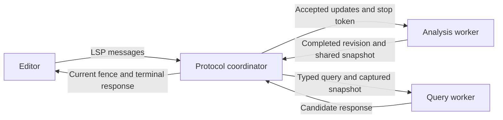

# Historical LSP implementation evidence

Historical evidence archived from `docs/design/lsp-cancellation/history.md` at `58b8f04965af`.
This records its named revision and execution profile; it is not current
workflow or implementation authority. Historical commands use their original
revision and paths. See the [archive index](../README.md).

Archived from the former maintainer entrypoint. Measurements and commands belong
to their named revisions, not the current tooling. Start with the
[current architecture](../../lsp-cancellation-design.md).

# LSP cancellation and responsive analysis

Implementation for [#206](https://github.com/plethu/recite/issues/206), based on local
measurements of `e941500b311c203d96bd414c276b8701c96c764d` on 2026-10-02.
The local implementation follows the measured ownership boundaries below. Requirements come from
the [production spec](../../recite-production-spec.md), sections 14, 19.5 and 23,
and the [editor parity contract](../../editor-parity-contract.md).

The subsequent [experience and CI experiments](follow-up.md)
cover sustained load, ranged sync, installed-client debounce and regression gates.

The [dependency decisions](dependency-decisions.md) preserve
framework and text-library spikes, reproducible evidence, and the
[reevaluation plan](dependency-decisions.md#reevaluation-plan).

The [final resource investigation](final-resource-profiling.md)
records Criterion timings, CPU/allocation attribution, and retained capacity reductions.

Keep protocol reception and publication on one coordinator thread. Give
analysis and queries one worker each, with immutable query snapshots and
cooperative cancellation through the synchronous compiler. Retain incremental
kernel state across source edits. Measurements show that moving requests alone
would leave the largest delay in the protocol loop: workspace refresh.

## Baseline measurements

The [archived baseline probe](baseline-probe.py) drove the real
release binary over stdio. Each scale has three fresh server processes, two
warmups per request class per process, and seven recorded samples per class per
process. Startup, open, schema refresh and burst each have three observations.
Raw observations, source hashes, binary/script hashes and toolchain identity are
in [medium.json](medium.json) and
[large.json](large.json).

Profile: AMD Ryzen AI 7 350, 8 cores / 16 logical CPUs, about 30 GiB RAM,
Linux 7.2.8-1-cachyos, Rust 1.96.0, Cargo release defaults. The machine was on
battery, with the balanced platform profile and powersave governor. No build
or other benchmark was run concurrently with these retained observations;
background desktop activity and CPU scheduling were not controlled. Filesystem
caches were warm. These are local diagnostic measurements, not the release
baseline owned by [#109](https://github.com/plethu/recite/issues/109).

| Fixture | Source files | Blocks | Dialogue lines | Choices | Generated words | Source bytes |
| --- | ---: | ---: | ---: | ---: | ---: | ---: |
| Medium, seed 7202 | 10 | 1,000 | 10,000 | 2,000 | 108,000 | 2,073,251 |
| Large, seed 7203 | 20 | 5,000 | 50,000 | 10,000 | 540,000 | 10,358,744 |

| Operation | Medium median ms | Large median ms | Large observed range ms |
| --- | ---: | ---: | ---: |
| Initial indexing after `initialized` | 75.46 | 409.45 | 401.79–416.26 |
| Open first source file | 75.95 | 419.15 | 419.09–424.75 |
| Single full-text edit through diagnostics and barrier | 69.37 | 403.60 | 389.16–419.41 |
| Block completion | 9.38 | 48.56 | 46.40–54.84 |
| Block hover | 0.91 | 2.07 | 2.02–2.82 |
| Definition | 1.37 | 2.55 | 2.48–3.14 |
| References including declaration | 1.90 | 5.09 | 4.73–6.06 |
| Prepare rename | 2.31 | 5.69 | 5.02–7.92 |
| Rename a referenced block | 9.59 | 42.73 | 42.40–46.34 |
| Code action with no repairs needed | 1.73 | 12.10 | 11.77–13.10 |
| Fix all with one missing stable-ID suffix | 3.33 | 18.00 | 17.40–19.44 |
| Open schema overlay with trailing whitespace | 70.01 | 412.93 | 411.37–421.83 |
| Cancelled rename queued immediately after an edit | 79.26 | 442.87 | 433.18–455.92 |

All 21 cancellation trials per scale returned successful edits. This measures
the baseline's unsupported cancellation path, not a worker's cancellation
checkpoint latency: the harness cannot observe when the server receives the
notification. The rename probe has a declaration and two references. It is not
a worst-case fan-out rename.

Three consecutive edits followed by completion took 216–220 ms on medium and
1,245–1,266 ms on large, measured from the first edit write. The server published
all three intermediate document versions. Completion's own timer began after
the earlier writes and observed 847–858 ms of delay on large. Pipe backpressure
means those writes consume some of the burst time; adding the timings would
double-count work. Large-process peak RSS was 285.0–285.1 MiB, from `/proc`'s
`VmHWM`, including startup and all measured workflows.

Requests had identical normalized result hashes within each scale across all
21 observations. Completion returned about 320 KB of normalized JSON on large;
its cost includes projection, serialization, transport and client decoding.
Nonempty results were required for the useful query probes and the missing-ID
repair. No project files were changed: all edits were editor overlays, and
on-disk hashes were rechecked after the runs.

The barrier is an unsupported request returning `MethodNotFound`, sent after a
notification. On this synchronous baseline its response follows refresh and
diagnostic publication. It is **not a valid future analysis-completion fence**
once request reception is decoupled. The implementation benchmark must wait for
the exact expected version's diagnostics or a benchmark-only analysis event.
This script is a baseline probe, not a future cancellation acceptance test.

Baseline commands, run before implementation (repeat against `e941500b` with
the archived probe and that revision's binary):

```sh
mise exec -- cargo build --locked --release -p recite-lsp -p recite-fixturegen
target/release/recite-fixturegen --profile medium \
  --output target/recite-benchmarks/generated/medium \
  --summaries target/lsp-cancellation/medium-summary.json
target/release/recite-fixturegen --profile large \
  --output target/recite-benchmarks/generated/large \
  --summaries target/lsp-cancellation/large-summary.json
diff fixtures/synthetic/summaries/medium.json target/lsp-cancellation/medium-summary.json
diff fixtures/synthetic/summaries/large.json target/lsp-cancellation/large-summary.json
mise exec -- python3 scripts/measure-lsp-latency.py \
  target/recite-benchmarks/generated/medium --runs 3 --samples 7 \
  --output target/lsp-cancellation/medium.json
mise exec -- python3 scripts/measure-lsp-latency.py \
  target/recite-benchmarks/generated/large --runs 3 --samples 7 \
  --output target/lsp-cancellation/large.json
```

The fixture output paths are disposable generated data. The measurement tool
is Linux-only because it records `/proc` memory and CPU evidence. It reports
sample ranges rather than pretending that 21 samples establish tail latency.
Epic, many small files, multiple roots, many open buffers, hostile input and
high-fan-out renames remain acceptance workloads for the implementation.

### What the source explains

At the measured baseline, `server.rs` executed requests and document
notifications in the receive loop. `lsp-server` 0.7.9 uses rendezvous channels
for stdio: a busy server also stops its transport reader from handing over the
next message. Merely adding a cancellation match arm cannot interrupt this work.

[`kernel_rebuild.rs`](../../../crates/recite-lsp/src/workspace/kernel_rebuild.rs)
retained kernels only for partitions whose entire input fingerprint was unchanged.
A changed partition started with a fresh kernel. The compiler already has
per-document reuse in [`engine.rs`](../../../crates/recite-compiler/src/authoring/engine.rs),
but that reuse cannot operate on a fresh kernel. This is a source-supported
explanation for expensive edits; it is not a measured percentage attribution.

The baseline CLI LSP report included workspace construction inside query
timings and never opened the completion document. The implementation separates
sample setup from measured work and opens completion inputs. Criterion change
setup now opens the file before measurement. Those reports remain distinct from
the persistent stdio measurements above.

## Implementation measurements

The [probe at the archived revision](https://github.com/plethu/recite/blob/1004de99594d/scripts/measure-lsp-latency.py) waits for an initial
semantic query and exact diagnostic URI/version fences after updates. The
baseline's unsupported-method barrier is no longer valid for asynchronous
analysis. Initial-index readiness therefore includes a definition query in the
new run; it should not be read as an exact isolated indexing comparison.

The edit workload appends comments to one source overlay; schema refresh adds
trailing whitespace. These exercise input replacement without changing project
semantics. The same medium/large fixtures, release profile, three fresh processes, two
request warmups and seven samples per process were repeated after implementation.
The machine remained on battery with balanced/powersave settings. No build or
other benchmark ran concurrently. Raw results are in
[medium-after.json](medium-after.json) and
[large-after.json](large-after.json), including binary and
script hashes. They identify the uncommitted working tree explicitly.

| Operation (median ms unless specified) | Medium before → after | Large before → after |
| --- | ---: | ---: |
| Open file | 75.95 → 4.72 | 419.15 → 14.16 |
| Edit and diagnostic refresh | 69.37 → 9.18 | 403.60 → 20.67 |
| Completion | 9.38 → 2.08 | 48.56 → 10.40 |
| Rename | 9.59 → 2.27 | 42.73 → 6.04 |
| Cancellation behind an edit | 79.26 → 0.34 | 442.87 → 0.56 |
| Three-edit burst and completion | 216.34 → 13.65 | 1262.88 → 32.67 |
| Schema overlay refresh | 70.01 → 3.06 | 412.93 → 10.02 |
| Peak process RSS, MiB | 75.57 → 49.45 | 285.09 → 169.17 |

Large edit-refresh p95 was 29.75 ms; cancellation-response p95 was 0.73 ms.
All 21 cancellations at each scale returned `-32800` without edits; all baseline
samples had returned edits. Each three-edit burst published only its final
version. Every recorded successful-query result hash, including fix-all's
versioned edits, matched the corresponding baseline hash. Fixture file hashes
were unchanged.

Code actions regressed in these observations: large no-op fix-all rose from
12.1 to 18.8 ms and the one-missing-ID fix-all from 18.0 to 24.7 ms. They remained
within the 50 ms diagnostic target, but the increase is retained in the record;
this experiment does not isolate its cause. Large initial-index readiness was
479.77 ms (462.79–592.52 ms) versus 409.45 ms under the older fence. That
readiness result is slower as well; the extra definition query prevents an
exact isolated indexing comparison. The persistent-index change also affects
initial construction, but this experiment does not attribute the increase to
a single cause. These gains concern retained analysis and interaction latency,
not faster initial project parsing.

The cancellation probe queues rename behind an edit. It measures prompt
protocol acknowledgement of pending work, not the time to stop a running parser.
Deterministic checkpoint tests establish interruption and rollback behavior;
large-file CPU stop latency still needs a separate instrumented experiment.

## Ownership and composition



The coordinator owns accepted versions, checked input revisions, topology and
partition epochs, request lifecycles, and publication. One analysis worker owns
discovery, schema loading, transactional workspace updates and diagnostics.
One query worker reads a captured `Arc<LspWorkspace>`. It never mutates the
workspace or sends protocol messages. The concrete `Query` enum binds each of
the seven supported LSP methods to typed parameters and one implementation.

The existing workspace is the snapshot carrier. A candidate clones its small
ownership maps while sharing kernels, source text, file summaries and the
injected UI catalog. Each successful analysis produces one shared snapshot;
requests do not clone the workspace. A frozen `QueryIndex` captures known URIs,
source aliases, schema classification and project ownership. Query projection
uses it instead of canonicalizing paths or loading a new schema while reading
an older semantic snapshot.

`recite_compiler::authoring::WorkControl` is a small host-neutral checkpoint
trait. `CancellationToken` supplies a shared atomic stop bit; custom hosts can
provide their own cheap interruption policy. The compiler returns typed
`Interrupted` failures without knowing protocol reasons, clocks or executors.
A borrowed `AuthoringQuery` composes project scans and edit plans under one
control. Existing synchronous APIs delegate through an uninterrupted context.
The existing artifact-oriented `BuildControl` remains separate.

Completion uses a compiler-owned block projection rather than materializing
stable IDs, metadata and function occurrences only to throw them away. Its
recoverable declarations and ordering are checked against the general symbol
query. Rename retains complete-project authority; the narrower completion
projection does not weaken edit preconditions.

The shared UI catalog uses Fluent's existing concurrent bundle. Custom injected
resources remain intact; a thread test formats the same injected resource from
two workers. Worker construction also checks the snapshot's Send/Sync boundary
through Rust's thread types. No new executor or worker-pool dependency was
introduced. `crossbeam-channel` was already in the lockfile through `lsp-server`
and is now a direct dependency for bounded channels and selection.

## Scheduling and freshness

Accepted inputs and completed analysis are separate states. The coordinator
validates sequential UTF-16 edits and strictly increasing open-document versions before
an update invalidates any work. It retains protocol text separately from analysis
and normalizes each accepted transaction to a full snapshot before coalescing.
Every request captures a unique internal job
serial and an input fence. It waits until a completed snapshot satisfies that
fence; positions are never silently reinterpreted against newer text.

Known source edits advance their partition epoch. Opens, closes, schema edits,
filesystem notifications and unresolved ownership advance a topology epoch.
That conservative topology fence also distinguishes close/reopen incarnations,
even when an editor restarts document versions at the same number. Queries with
unresolved ownership depend on every input revision. Kernel generations remain
local to kernels and never stand in for protocol freshness.
Cached URI ownership is also treated as unresolved while a topology change
awaits analysis; edits cannot use the previous manifest's partition assignment.

The pending update log coalesces full-text changes only within consecutive
change segments. Open, close, save and watched-file notifications remain ordering
barriers. A request between coalesced revisions is terminated with an explicit
stale result. The log is retained until a fully completed candidate acknowledges
its input sequence. Interrupted candidates discard their entire workspace copy;
partially applied lifecycle transitions never become query snapshots.

A single-partition source job can be superseded when all pending changes still
belong to that partition. Bootstrap and mixed-partition jobs finish their bounded
batch instead: a busy editor cannot continually restart a sibling's analysis.
A completed but superseded snapshot remains a useful analysis cache. Its current
partitions can serve requests while other partitions catch up. This avoids a
second scheduler inside the analysis worker; a larger pool or finer per-partition
jobs can be added if measurements show that this policy is insufficient.

The coordinator processes at most 32 ingress messages before arbitrating ready
output and worker results. There is at most one active analysis and one active
query, with capacity-one worker channels. The request registry admits 64
unpublished requests; the ordered update log and miscellaneous output queue each
allow 256 entries. Limits count messages, not source bytes. Saturated query
capacity returns a typed busy error. Full update or miscellaneous-output queues
pause ingress until analysis or transport handoff makes room. Diagnostic
publications instead admit one complete analysis batch, sized by the accepted
workspace. No next analysis starts until that batch drains or becomes stale.
This allows more than 256 open buffers while keeping diagnostic batches from
accumulating behind a slow client. Ingress, cancellation and query dispatch
continue while the batch drains, unless the separate control or update queue
is full. At that limit, later input, including cancellation, waits for capacity.

Candidates are checked again before nonblocking transport handoff. Diagnostics
are coalesced by exact URI within the analysis batch. If a queued diagnostic
becomes stale, its URI is carried into the next analysis for recomputation. This includes clears: an old
close cannot leave stale diagnostics behind, or clear a later reopened buffer.
Deferred URIs retain their publication order, so schema alias transitions keep
the canonical clear before the new owner's diagnostics after recomputation.
Successful query responses follow queued diagnostics, preserving the existing
feature-barrier behavior. Cancellation responses may pass diagnostics.

## Cancellation and shutdown

Cancellation stops pending, running or completed-but-unpublished requests.
Client cancellation wins over an already-stale candidate until handoff. The
coordinator sends exactly one terminal response, independently of when the CPU
worker acknowledges interruption and releases its physical slot. A late worker
result is matched by internal serial, never by a reusable JSON-RPC request ID.
Unknown, duplicate and post-publication cancellation notifications have no
response. Reusing an active request ID is a protocol failure.

| Cause | Protocol response |
| --- | --- |
| Observed client cancellation | `RequestCancelled` (-32800) |
| Superseded input fence | `RequestFailed` (-32803), `data.reason = "stale_snapshot"` |
| Request capacity reached | `RequestFailed` (-32803), `data.reason = "server_busy"` |
| Request interrupted by shutdown | `RequestFailed` (-32803), `data.reason = "shutdown"` |

This follows the [LSP cancellation contract](https://github.com/microsoft/language-server-protocol/blob/gh-pages/_specifications/lsp/3.17/specification.md#cancellation-support-arrow_right-arrow_left).
Ordinary edits do not use `ContentModified`; these methods do not opt into
`ServerCancelled`. Cancelled edits never return partial `WorkspaceEdit` values.
A client timeout alone is not evidence that the server cancelled a request.

Initialization advertises capabilities before discovery/indexing begins. After
`initialized`, the coordinator can accept requests, cancellation and shutdown
while the analysis worker indexes the project. Shutdown stops accepted requests
and analysis; exit/EOF paths interrupt outstanding CPU work and join both
workers. Worker loss fails the connection explicitly. Cooperative cancellation
does not interrupt an OS filesystem call or a blocked stdio write.

## Transactional compiler work

`AuthoringKernel::updated` prepares a new kernel from borrowed committed state.
Unchanged document analyses and project indexes use shared ownership; candidate
index changes use copy-on-write. `apply_with_control` installs the candidate only
after its final checkpoint. Cancellation tests stop at every checkpoint and
compare both the old snapshot and a subsequent successful update with an
uninterrupted candidate.

Symbol membership uses
[`rpds::HashTrieMapSync`](https://docs.rs/rpds/1.2.1/rpds/type.HashTrieMapSync.html),
a persistent hash trie. Membership is lookup-only; sorted document sets and
diagnostic ordering retain deterministic observable results.
The writer's existing allocation gate exposed the cost of cloning a standard
map for an ID edit. The persistent map shares unchanged trie nodes, while
membership updates apply only added and removed symbols. Span-only changes keep
the membership map intact. This adds the MIT-licensed `rpds` dependency and its
`archery`/`triomphe` support crates; no collection implementation is owned here.

Project validation shares overlapping dependency contexts in batches. A 3,072
passage budget bounds the temporary AST materialization added by batching; a
single target's required context is never truncated. The batch validator remains
the policy owner and only affected target diagnostics are published.

The LSP retains kernels across ordinary source edits. It rebuilds when schema
semantics change or an alias switches the effective owner of an already-open
logical key, preserving overlay-version rules. Equal schema semantics can reuse
analysis even when presentation/overlay metadata changes. The workspace still
publishes one atomic transition for multi-partition and schema operations.

Checkpoints cover document analysis boundaries, incremental project-index work,
project symbol/reference scans, stable-ID planning, edit preconditions, and edit
projection. Parser calls, some per-document scans, sorts, schema loads and
filesystem discovery are indivisible stages. A single giant file can therefore
have a longer CPU stop delay than the measured sharded fixture. Protocol
cancellation response time and actual worker stop time are distinct; the stdio
probe measures the former, not a hard CPU interruption guarantee.

## Verification and limits

All local `just check` lanes passed. The full run found the allocation regression
and an intermittent schema-alias publication-order failure; after fixes,
verification resumed from the failed lanes. The review follow-up also fixed a
benchmark adapter after summaries became shared. Final evidence includes 1,545
workspace tests (three skipped), workspace doctests/Clippy/rustdoc, writer tests
and both unchanged heap budgets, editor and engine checks, dependency policy,
Flatpak metadata, documentation and benchmark smoke. The schema-alias suite
also passed 30 repeated runs. Writer tests require local sockets and subprocess
signaling; the sandbox-restricted attempt failed and the permitted run passed.
The uncommitted Rust diff was scanned separately for structural violations and
added lint permissions, since committed-range policy checks do not cover it.

Deterministic tests cover cancellation before dispatch, during work and after a
candidate completes; cancellation after publication; request-ID reuse; partition
freshness; coalescing and reopen versions; capacity rejection; blocked-writer
handoff; superseded diagnostic clears; sibling progress; serial exhaustion; and
worker loss. Compiler checkpoint tests cover atomic analysis replacement,
project scans and edit plans. The real stdio test also checks cancellation,
subsequent successful requests, and no duplicate or unknown-ID response.
Existing cross-file navigation, UTF-16, alias, manifest, schema retirement,
localisation and source-edit tests remain acceptance evidence.

The editor parity contract claims shared-server evidence only. Installed-editor
cancellation and non-Linux acceptance remain unclaimed. These local changes do
not close #206 or establish the separate #109 release benchmark baseline.

The 50 ms query and 100 ms edit figures in spec section 19.5 remain diagnostic
targets. Capacity choices need broader sustained-typing, many-root, many-open-
document and giant-file measurements before they become release guarantees.
No cancellation latency is inferred from a timeout, and no hard bound is claimed
for blocking I/O or one indivisible semantic stage.

Touched source over the 250-line scrutiny threshold remains cohesive: workspace
state/diagnostic types, partition transaction construction, indexed project
ownership, LSP query projection, report assembly, and the persistent stdio probe.
Timing statistics and report operation setup were split into their own modules;
request lifecycle, freshness, workers and scheduling also have separate owners.
Test/support files remain below their 500-line threshold. No new lint
suppression or maintainability exception was added. The baseline probe is
archived unchanged so its recorded hash remains reproducible. The Mermaid
diagram is maintained as source; its graphical rendering was not checked.


## Adversarial review follow-up

The independent GPT-6 Sol review reproduced a consuming client's disconnection
on its 257th untitled buffer, and roughly 205 ms latency for a 623-edit rename.
Both paths now have regression coverage. The follow-up also found pipelined
error replies exhausting control output; ingress now applies backpressure, with
600-request and 270-open-buffer pipeline regressions. Diagnostic capacity is scoped to one
analysis batch; edit validation and UTF-16 projection use a source-bound line
index, with cancellation checkpoints between edits. Plans validate their
immutable shape when constructed, and validate snapshot freshness and ranges
when projected.

Profiling also led to cursor-filtered symbol projection, collision checks over
borrowed block declarations, cached source fingerprints, and a reverse document-to-URI
index. The full symbol ordering and conservative completeness rules remain
unchanged. LSP document summaries reuse unchanged compiler analysis and
diagnostics; manifest discovery reports are shared between snapshots.

The [profiling report](profiling.md) distinguishes the
retained before/after stdio measurements from sampled CPU attribution and
changed-file scaling experiments. The original `*-after.json` reports above
remain the pre-review implementation measurements; `*-optimized.json` reports
record the follow-up implementation.


Final large-project medians after review are **17.86 ms edit-to-diagnostics**,
**0.30 ms ordinary rename**, **2.90 ms for 623 rename edits**, and **0.57 ms
cancellation response**. Maximum observed RSS is 150.41 MiB. Query result hashes
remain equal to the baseline. The paired edit experiment confirms a smaller
improvement than rename; full changed-file analysis is still the dominant cost.
Completion and burst latency did not improve in the retained run.

The full gate passed with 1,545 workspace tests and three skips, including both
unchanged writer heap budgets. The final ingress-backpressure follow-up added
three tests and passed the complete LSP suite and Clippy again. The independent
Sol follow-up found the control-response capacity issue, confirmed its ingress
fix, and reported no other concrete regression in the indexed source, rename,
summary reuse or URI cache changes. Its follow-up was code-only; the test and
profiling evidence above was collected by the coordinating session.

## Reusing analysis within an edited file

The parser now owns restart boundaries through `source_regions`: a region begins
at an unindented block marker, or at the start of the file. Indented markers stay
inside their enclosing region, including malformed syntax. Parsing a region
retains original file-relative spans; its lossless tree contains the region's
text. Batch parsing and the public source AST retain their existing behavior.

The authoring kernel matches unchanged region bytes in the prefix, suffix, and
unchanged middle positions. Cached regions retain only offsets into the document's
summary, project facts, and diagnostic arrays. They do not retain an AST, syntax
tree, second source string, or duplicate per-region output arrays. Unchanged
outputs share their document allocation. Slice identity skips repeated equality
walks; changed slices still require exact value equality before reuse.

Recovery participation is combined across the entire file before local
validation. A change in that participation reruns local analysis even in
unchanged regions. Otherwise, line insertions/deletions relocate compact outputs
and all local diagnostic locations, including structured related presentations.
Relocation runs on the final assembled arrays, avoiding temporary copies of each
shifted region. These arrays are separate from earlier immutable snapshots.
Checked position conversion falls back to a fresh file analysis if relocation
is unavailable.
Cancellation is checked between region operations, and candidates remain
unpublished until the existing transaction commits.

Position-only project revisions preserve the exact ordered definitions, IDs,
references, defaults, and participation. They can update indexed facts and map
cached diagnostic locations without rebuilding symbol memberships or repeating
project validation. Primary and related locations in other documents move too.
An unknown diagnostic location, conflicting span mapping, semantic change,
removal, or project-completeness change uses the existing validation path.
A stable-ID recovery transition invalidates choice-echo consumers, the only
checks using that project-wide completeness gate. Export/reference dependencies
still invalidate their consumers normally; unrelated files are not revisited
solely because the stable-ID gate changed.

LSP diagnostic publication indexes each source once per publication, constructs
sort keys once per diagnostic, and lazily indexes related documents. UTF-16
clamping, inclusive diagnostic ends, deterministic ordering, and catalog
rendering retain their existing behavior.

Differential checks compare segmented lowering to full-file lowering over the
fixture corpus and malformed/nested fragment combinations. Revision sequences
cover Unicode, CRLF, recovery changes, symbol edits, insertion, deletion,
reordering, duplicates, schema validation, and relocated cross-file diagnostics.
Checkpoint-budget tests compare a committed snapshot before and after every
interrupted candidate. A work-count regression requires prose edits and newline
insertion to parse only the changed region.

The new production modules stay below the 250-line scrutiny threshold. Summary
collection remains cohesive with its existing syntax-to-summary visitor; region
composition lives in a separate module. Parser entry points remain the public
syntax facade. Project-index membership and its guarded diagnostic relocation
have separate modules. The existing authoring validation tests now put region
revision cases in a dedicated test module. Diagnostic publication remains one
cohesive wire-projection boundary, with line conversion owned by `position`.

Saved schema refreshes still resolve aliases and read disk on each rebuild.
Matching bytes, source identity and format permit reuse of the parsed schema;
overlay closure restores disk authority. The subsequent bounded schema, path
and relocation experiments are recorded in
[the experiment report](prototypes.md).

The final same-condition large-project comparison measured **13.47 → 3.95 ms**
median edit-to-diagnostics in the mixed workflow. The alternating edit study
measured **13.15 → 2.98 ms** for prose, **21.63 → 6.89 ms** for newline insertion,
and **126.28 → 21.36 ms** for recovery transitions. Medium mixed edit median is
1.35 ms. The profiling report retains raw samples, startup/memory tradeoffs,
semantic-edit tails, power conditions and remaining large-file costs. These are
local stdio observations, not installed-editor or cross-platform guarantees.
