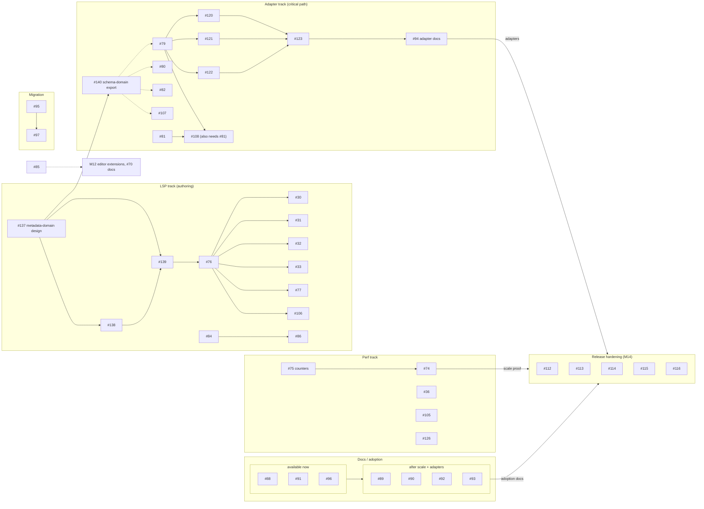

# Recite v1 Dependency Roadmap

A snapshot of how the open v1 milestones and issues depend on each other: what
can start now, what's blocked, and what's on the critical path.

This is a planning aid. The live Codeberg board and
`docs/recite-production-spec.md` §22–23 are authoritative; the issue numbers and
edges here were pulled from the "Depends on" lines in issue bodies on 2026-05-30,
and will drift as work lands.

## v1 scope

Per spec §23, v1 is broader than "core + CLI + LSP." It requires all of:

- core runtime, CLI, and LSP authoring support;
- a scale and performance proof;
- a stable engine-adapter contract;
- at least one production-quality engine adapter;
- adoption and migration documentation that lets a team evaluate Recite against
  established dialogue tooling.

The release-hardening milestone (M14) can't complete until scale, adapters, and
adoption docs have all landed.

## Work that can start now

These issues have no unmet dependencies. One of them unlocks a whole authoring
track; the rest are independent and can run in parallel.

| Issue | Role | Unlocks |
| --- | --- | --- |
| #137 Metadata-domain design | unblocks a track | metadata value syntax, contextual validation, LSP schema-domain support, adapter schema export |
| #75 Trace performance counters | leaf | — |
| #88 Docs site scaffold | leaf | later docs content |
| #91 Rustdoc API examples | leaf | — |
| #96 Migration transition guides | leaf | — |
| #95 Importer-boundary design | design | #97 |
| #81 Unity adapter design | design | feeds #108, Unity refresh |
| #83 Editor highlighting strategy | design | M12 editor extensions |

## Tracks

Each track below starts from one of the issues above. They all feed the release
milestone.



## Critical path

The adapter chain is still the longest release chain, but the original adapter
contract design issue (#78) is now closed. The current open chain is:

```
#79 conformance + per-engine adapter MVPs → per-engine refresh workflows → adapter docs → release verification
```

The new metadata-domain design gate (#137) also matters for both authoring and
adapters. It feeds the LSP schema/index work (#76, #30, #31, #77) and the
resource-backed schema-domain export contract (#140), so it should be resolved
before treating schema-aware completions, diagnostics, or adapter schema export
as routine implementation.

## Release hardening

The M14 "Release:" issues (#112–#116) sit at the end of the graph. They can't
start until scale, adapters, and adoption docs are in place.
