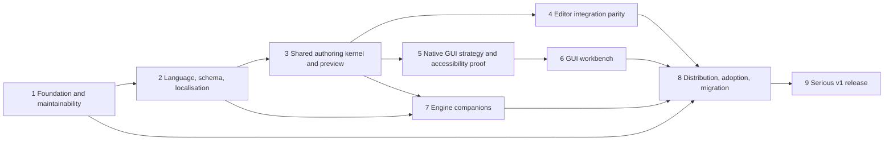

# Recite serious-v1 roadmap

This roadmap describes the outcomes that must exist before Recite can call its
authoring and integration story serious v1. It is deliberately organised around
product boundaries and evidence rather than a sequence of issue numbers. The
production specification is the normative contract; this document explains the
order in which that contract becomes a usable product.

Recite is still pre-release. The compiled asset, runtime snapshot, schema
manifest, CLI, LSP, editor integration, GUI, and adapter surfaces are all
compatibility decisions until the first tagged release. Existing work should be
mapped into these milestones without preserving an older milestone merely
because it has already been named.

## The v1 product

Serious v1 is a local-first dialogue authoring product with:

- a deterministic Rust language, compiler, runtime, schema model, and
  localisation pipeline;
- a shared authoring kernel used by the CLI, LSP, editor clients, preview, and
  standalone GUI;
- first-class VS Code/VSCodium, Neovim, and Zed text-authoring paths;
- IDE/text editing is expected to be the primary workflow, with an accessible,
  source-first GUI workbench as a first-class complementary surface providing
  schema and localisation views, structured preview, diagnostics, and graph
  navigation;
- thin, engine-native Godot, Unity, and Bevy companions that preserve the same
  runtime contract;
- Linux, Windows, and macOS as first-class desktop platforms for the core CLI,
  LSP, editor integrations, and standalone workbench; companion matrices may
  declare narrower engine/platform combinations;
- documented distribution, migration, support, and compatibility boundaries.

The GUI workbench is required for serious v1, but a fully general visual node
editor is not. Source remains authoritative. Graphs may navigate and explain
the source before they become a second authoring representation, and any
structured edit must preserve source, comments, unknown metadata, and stable
IDs. Generated host-language bindings and arbitrary mid-session patch reload
remain post-v1 unless a later decision promotes them.

## Dependency shape

Milestones 4, 5, and 7 may proceed in parallel after the shared kernel and
milestone-2/3 contracts and fixtures are stable. Milestone 6 starts only after
the GUI strategy has earned its decision. Distribution work can prepare in
parallel, but release cannot close until every declared platform and companion
has passed its acceptance gate.

## Milestones

### 1. Product Foundation and Maintainability

**Outcome:** the codebase has explicit ownership boundaries that can support a
language toolchain, multiple authoring surfaces, and external adapters without
duplicating semantics.

**Scope:**

- audit large and cross-cutting modules by cohesion and ownership, not line
  count alone; use Batten-derived ast-grep structural gates for sprawling
  constructs, test placement, module ownership, generated boundaries,
  documented exemptions, and checks close to the change;
- keep parser, compiler, schema, runtime, wire, snapshot, FFI, diagnostics, and
  adapter responsibilities explicit;
- resolve typed error ownership at serialization, FFI, schema, and host
  boundaries;
- settle the pre-release compiled-asset and snapshot compatibility policy;
- establish shared fixtures for deterministic IDs, source maps, errors,
  localisation, and adapter traces;
- record which projection capabilities are schema-only, adapter-capable, or
  outside v1; line count remains a trigger for review, not the maintainability
  rule.

**Entry gate:** current pre-release implementation and its existing tests.

**Exit gate:** the ownership audit has actionable results, no known duplicate
semantic authority remains, compatibility decisions are written down, and the
full repository verification gate passes.

**Status:** Complete as of 2026-08-27. PR #174 merged as `d8f9f7d`, delivering
the ownership and maintainability gates, typed boundary corrections,
compatibility decisions, shared fixtures, and CI evidence for this outcome.
Trusted-policy activation remains a post-merge operational follow-up.

### 2. Language, Schema, and Localisation Readiness

**Status:** Complete as of 2026-08-29. PR #183 merged as `5881976`, with
correction PR #184 merged as `c023f26`; together they deliver this outcome,
including the corrected contextual metadata resolution semantics.

**Outcome:** authors and host integrations can rely on one stable semantic model
for source, schema, IDs, localisation, diagnostics, and generated artifacts.

**Scope:**

- finish the source-format, schema, metadata-domain, effect, and stable-ID
  contract needed by authoring clients;
- define a source-owning schema-authoring capability while keeping generated
  manifests as read-only compiler/LSP input; define at least one source-owning,
  kernel-editable declarative producer path suitable for GUI integration for
  standalone projects and producer-backed edit/open-declaration actions for
  engine-owned schemas;
- preserve producer provenance and explicit stale-schema actions; unsupported
  producers are explicitly read-only, not counted as schema editing;
- choose the exact standalone schema-source syntax as a milestone decision,
  provided it lowers to the canonical model deterministically;
- provide source-preserving localisation extraction, catalog loading, fallback,
  placeholder validation, markup validation, and a required editable gettext PO
  path with lossless comments/context/unknown-data handling and safe atomic
  writes; other catalogues are read-only or import/export-only;
- define one canonical shared Fluent resource set (not necessarily a new crate)
  for all Recite-owned CLI/TUI, GUI, LSP, and editor-extension UI text, with
  extraction/completeness checks; generate host-specific projections where a
  host manifest or metadata surface cannot consume Fluent directly, and keep
  host-required metadata distinct from Recite-owned strings; published locales
  require human authorship and review;
- keep English-only launch behavior explicit without counting machine-generated
  translations as supported locales;
- make locale selection and variant selection explicit rather than inferred from
  the host environment;
- keep compiled assets and runtime state self-contained at their declared
  boundaries.

**Entry gate:** the foundation has identified the compatibility surfaces and
remaining semantic gaps.

**Exit gate:** representative projects compile, validate, extract, load schema,
check IDs and localisation, and produce deterministic assets and diagnostics;
the source-owning schema capability and fixtures define at least one
source-owning, kernel-editable standalone declarative producer path suitable for
GUI integration plus producer-backed edit/open-declaration actions for
engine-owned schemas. Generated manifests remain read-only; the shipped GUI
realization is gated by milestone 6. English is the launch locale, but the
public contracts and tests exercise catalog and fallback behavior.

### 3. Shared Authoring Kernel and Preview

**Status:** Complete as of 2026-09-01. PR #191 merged as `636fa1b`, closing
#187–#190 and delivering the shared authoring kernel and structured preview
boundary. Together with #167, #168, and #185, the milestone-19 owner group is
complete with eight closed milestone items; GitHub milestone 19 remains open
with zero open issues because this follow-up does not mutate tracker state.

**Outcome:** CLI, LSP, text clients, GUI, and future tooling call the same
host-neutral authoring operations.

**Scope:**

- project discovery, source roots, excludes, canonical paths, and deterministic
  file ordering;
- saved-project indexes overlaid by unsaved documents;
- source-preserving edit transactions for stable-ID insertion, rename, block
  stubs, metadata edits, and future structured edits;
- structured diagnostics, completions, navigation, schema summaries, and
  localisation/catalog summaries;
- source-owning schema edits for the standalone declarative producer and
  producer-backed edit/open-declaration actions for engine-owned schemas,
  concretely covering open source declaration, invoke/regenerate through the
  producer, stale-output status, structured failure and retry, and never writing
  generated manifests directly;
- cross-platform user configuration for UI locale, keymap, contrast, theme,
  workspace preferences, and preview defaults, kept separate from project
  content and generated artifacts; resolve platform locations through one
  OS-aware strategy (for example, `etcetera::choose_base_strategy()`), with
  `$RECITE_CONFIG` as the explicit override;
- distinguish explicit dialogue locale selection from Recite UI locale, where
  `system` may resolve through a deterministic fallback chain;
- typed watch/build/freshness status and cancellation rather than GUI code
  parsing CLI prose;
- one preview driver over the real runtime event stream, fixture state, locale
  providers, and effect requests.

The first implementation may remain in existing crates where extraction would
add indirection without reducing duplication. A new authoring crate is earned
only when the shared ownership and API are clear.

**Entry gate:** language, schema, and localisation models are ready enough to
be queried without reinterpreting source in each client.

**Exit gate:** CLI and LSP consume the shared operations; unsaved overlays,
source edits, source-owning schema edits, diagnostics, schema/localisation
views, watch status, and preview traces have fixture coverage; preview never
executes game-side effects.

### 4. Editor Integration Parity

**Status:** Implementation and bounded installed-host evidence landed on
2026-09-05/06, but the exit gate remains open. PR #200 delivered the remaining
VS Code/VSCodium, Neovim, Zed, grammar, structured-command, parity, and
maintainability work after PR #198 established the Neovim setup and shared
editor foundations. The recorded host lanes cover Linux x86_64 VS Code,
VSCodium, Neovim, and Zed paths incrementally; they do not establish the
unclaimed platform, accessibility, publication, or Zed task/semantic behavior
listed in the contract. PR #204 closed #51 and #202 after recording that host
evidence; #53 and #192 remain open for their residual acceptance boundaries.

**Outcome:** text authoring is safe and discoverable in the editors users
already choose.

**Scope:**

- VS Code and VSCodium extension/client wiring, highlighting, commands,
  structured diagnostic integration, outline, and quick preview/trace;
- Neovim filetype, documented LSP setup, highlighting, and command examples;
- Zed language integration and task/diagnostic wiring through its supported
  language-server surface;
- one parity fixture set for diagnostics, completion, hover, definition,
  references, rename, code actions, UTF-16 positions, malformed buffers,
  schema changes, and localisation-aware information;
- tested semantic parity and syntax highlighting in each editor; Neovim uses
  Tree-sitter or a named tested fallback, and Zed documents its minimum
  command/diagnostic surface and any host limitations;
- documentation that distinguishes syntax grammars from semantic authority.

**Entry gate:** the shared authoring kernel, reusable parity fixtures, and LSP
contract are stable; clients need not be complete before the bake-off starts.

**Exit gate:** the same source and schema fixtures give equivalent semantic
answers in VS Code/VSCodium, Neovim, and Zed; required keyboard workflows work
without a GUI workbench; editor docs contain tested setup instructions.

### 5. Native GUI Strategy and Accessibility Proof

**Outcome:** Recite chooses its GUI strategy from evidence rather than
framework enthusiasm.

**Candidate lanes:**

- unified Rust frontends, including Freya 0.5 RC, Floem, GPUI, and
  Xilem/Masonry candidates;
- platform-appropriate frontends: SwiftUI/AppKit on macOS, WinUI 3 including a
  separate `windows-reactor` Rust evaluation and experimental C#
  `Microsoft.UI.Reactor` fallback on Windows, and a
  Linux-native GTK/GtkSourceView path where that is the chosen host;
- Avalonia using code-first C# as the primary non-Rust cross-platform control;
- Qt, Flutter, Compose, Slint, and wxWidgets remain comparison baselines, not
  commitments. A candidate must earn its place through authoring and
  accessibility evidence, not only renderer reach or feature lists.

The bake-off uses the same project, source, schema, catalog, and preview
fixtures. It measures source editing, undo/redo, external changes, diagnostics,
schema completion, localisation preview, graph navigation, startup, memory,
packaging, and maintenance boundaries. Non-Rust/native candidates must also
document the kernel crossing (in-process binding or local process protocol),
protocol/versioning, structured requests/errors, cancellation, stale
generations, source edits, and packaging. No candidate may introduce a second
semantic implementation. Accessibility proof includes keyboard-only operation,
focus order, screen readers, IME composition, BiDi/RTL text, zoom/text scaling,
high contrast, non-colour cues, live diagnostics, progress/status announcements,
failure/retry, focus retention/restoration, external-file/save conflicts,
reduced motion, and manual assistive-technology verification where automation
is insufficient.

The bake-off includes an explicit candidate-by-platform applicability matrix.
Each claimed candidate/platform cell is tested; candidates are not required to
run on every operating system. The decision record names selected cells,
unsupported cells, and the reason for each unsupported claim.

**Entry gate:** the shared kernel, reusable editor-parity fixtures, and preview
loop exist well enough to compare hosts without rebuilding Recite semantics in
each one; completed editor clients are not a prerequisite.

**Exit gate:** a checked-in decision record names the chosen frontend strategy,
declared platform support, fallback path, known limitations, maintenance cost,
and reconsideration triggers. No production workbench implementation is the
default merely because it was easiest to prototype.

### 6. GUI Workbench

**Outcome:** writers can use an accessible standalone workbench without losing
the text-first workflow.

**Scope:**

- project open/discovery, source tree, tabs, search, outline, and graph
  navigation;
- source editor with diagnostics, completion, navigation, rename, stable-ID
  actions, undo/redo, atomic saves, and external-change conflict handling;
- schema browser and completion/provenance views, with explicit source-owning
  schema editing for the standalone declarative producer and producer-backed
  edit/open-declaration actions for engine-owned schemas. Actions open the
  source declaration, invoke/regenerate through the producer, report stale
  output, surface structured failures and retry, and never write generated
  manifests directly; unsupported producers are visibly read-only;
- gettext PO catalog browser and editor as the required v1 editable catalogue
  path, preserving comments, context, unknown data, source IDs, placeholders,
  markup, fallback, and preview locale with safe atomic writes; other catalog
  formats are explicitly read-only or import/export-only;
- structured preview and trace views driven by the shared runtime loop;
- accessible list/table alternatives for graph information and every essential
  action; automatic layout is the default, viewport state is transient/local,
  and an optional checked-in open sidecar keyed by stable IDs may preserve
  layout without becoming dialogue semantics;
- user configuration stored through the shared cross-platform configuration
  contract, not in project content;
- asynchronous status with stale-generation handling, cancellation,
  progress/status announcements, failure and retry, focus retention/restoration,
  external-file and save-conflict recovery, and reduced-motion behavior.

**Entry gate:** the selected strategy has passed the bake-off and the shared
preview/editor contracts are available.

**Exit gate:** a writer can edit a scene, repair a diagnostic, author supported
schema declarations without touching generated manifests, edit gettext PO
catalogues safely, preview a condition/effect path, rebuild, and recover from
an external change using keyboard and screen-reader workflows on Linux, Windows,
and macOS. The workbench has no independent parser, compiler, runtime, or
schema truth.

### 7. Engine Companions

**Outcome:** Godot, Unity, and Bevy users get thin, idiomatic companions rather
than three divergent dialogue implementations.

**Scope:**

- compiled asset loading, compatibility/freshness checks, session ownership,
  start/select/ack/end, conditions, effects, save/load, localisation, and
  structured errors;
- host-native schema producers that lower to the canonical generated manifest,
  with producer-backed edit/open-declaration actions rather than direct
  manifest editing;
- the edit → diagnostics → watch → import/refresh → restart or explicit
  active-session policy loop;
- host-independent conformance traces plus host-specific integration tests and
  small examples;
- ecosystem-shaped packages: Godot addon/Asset Library path, Unity Package
  Manager path with runtime/editor separation and native-library packaging, and
  crates.io/Bevy plugin/example path.

**Entry gate:** the adapter contract, schema and localisation models, FFI
boundary where needed, and shared preview/runtime semantics are stable. The
GUI is not a prerequisite.

**Exit gate:** each companion passes the adapter acceptance matrix, declares and
tests exactly one changed-asset policy, demonstrates localisation and save/load,
and can be installed without copying internal repository paths. Bevy's adapter
must exist before its refresh workflow is counted complete.

### 8. Distribution, Adoption, and Migration

**Outcome:** a team can install Recite, understand its boundaries, evaluate it,
and migrate content without reverse-engineering the repository.

**Scope:**

- release channels for CLI, LSP, GUI, editor integrations, and companions;
- platform compatibility, package metadata, native library distribution,
  checksums/signing, upgrade notes, and known support limits;
- complete headless, workbench, and engine workflow examples;
- authoring, schema, localisation, testing, preview, refresh, and save/load
  guides;
- structured import reporting and provenance, with honest compatibility notes
  for Ink, Yarn Spinner, Clyde, Dialogic, Dialogue Manager, Dialogue System for
  Unity, and adjacent tools. Clyde is guidance-only in v1: it has no promised
  importer or compatibility runtime;
- bounded subset importer work tracked by #99–#104: #99 owns the shared import
  report/provenance model, #100–#103 own source-family subset importers, and
  #104 owns compatibility notes. This is provenance-preserving migration help,
  not full runtime compatibility with another tool.
- alternatives and adoption guidance based on shipped behavior rather than
  aspirational framework comparisons.

**Entry gate:** the first-class desktop workflow and all declared companion
paths have stable installation and authoring workflows.

**Exit gate:** public docs, examples, package instructions, migration reports,
and support policy agree with the actual release artifacts; no core adoption
path depends on a draft page or an unverified claim.

### 9. Serious v1 Release

**Outcome:** Recite can make a bounded, supportable compatibility promise.

**Entry gate:** milestones 1–8 are complete, the compiled format and snapshot
policy are frozen for the release, and all required reviews are resolved.

**Exit gate:**

- the serious-v1 acceptance criteria in specification §23 pass;
- Rust, CLI, LSP, editor-integration, GUI, and companion verification passes on
  every declared platform;
- accessibility evidence covers the declared GUI platforms and essential
  authoring workflows;
- scale, memory, preview, watch, and adapter measurements have a named profile
  and regression policy;
- the pull-request and main-branch benchmark smoke remains a fast build and
  execution check; #109 owns the fuller named release/scheduled benchmark
  baseline and regression suite, while #77 owns its evidence ledger and release
  gate decision;
- release artifacts install and run from their published distribution paths;
- known limits, migration boundaries, active-session behavior, and future
  non-goals are published;
- a clean release candidate can be rebuilt from the repository and its
  documented toolchain.

## Secondary issue mapping

Issue links are deliberately secondary to this outcome map. The table records
the verified current GitHub owner groups and open counts; the outcome gates
remain authoritative if the tracker is split again.

| Outcome | Current GitHub owner group (open count) | GitHub milestone |
| --- | --- | --- |
| Product Foundation and Maintainability | Complete (0 open; 8 closed milestone items; delivered by PR #174) | 17 |
| Language, schema, and localisation readiness | Complete (0 open; 12 closed milestone items; delivered by PR #183 and correction PR #184) | 18 |
| Shared authoring kernel and preview | Complete (0 open; 8 closed milestone items; delivered by PR #191; #167, #168, and #185 complete) | 19 |
| Editor integration parity | In progress (2 open: #53 and #192; implementation delivered by PR #200 and bounded Linux host evidence by PR #204) | 20 |
| Native GUI strategy and accessibility proof | [#54 GUI strategy](https://github.com/plethu/recite/issues/54), [#123 accessibility requirements](https://github.com/plethu/recite/issues/123) (2 open) | 21 |
| GUI workbench | [#170 GUI workbench](https://github.com/plethu/recite/issues/170) (1 open) | 22 |
| Engine companions | #49, #83–#86, #132–#134 (8 open) | 23 |
| Distribution, adoption, and migration | #38, #56, #57, #60, #99, #100–#103 (bounded subset importers), #104 (10 open) | 24 |
| Serious v1 release | #77–#81, #109 (6 open) | 25 |
| Post-v1 / no milestone (non-exhaustive tracker group) | #74, #119, #121, #126 (4 open); generated host-language bindings and other deferred directions still need future ownership | — |

M17 is complete with 0 open and 8 closed milestone items. PR #174 delivered the
foundation outcome; trusted-policy activation remains a post-merge operational
follow-up. Issues #59 and #61 are closed and superseded, so they are omitted.

M19 is complete as of 2026-09-01: PR #191 delivered the shared authoring kernel
and structured preview outcome and closed #187–#190. GitHub milestone 19 remains
open with 0 open issues; this roadmap records the outcome without changing the
tracker.

M20 implementation landed on 2026-09-05. PR #200 delivered the remaining editor
integration work after PR #198 established the first foundations; #97, #98, and
the cross-cutting #197 follow-up are closed. PR #204 added bounded Linux x86_64
activation, LSP, command/watch, and keyboard host records for VS Code,
VSCodium, Neovim, and Zed, closing #51 and #202. The records keep unsupported
operations explicit and do not claim non-Linux or broader accessibility
evidence. #53 remains open for complete per-client command/task lifecycle
parity, and #192 remains open for Zed's unproven/non-native semantic and task
boundaries. The M20 exit gate therefore remains open.

The post-v1 row is deliberately non-exhaustive: it records current open issues
without a milestone, not every deferred capability. Generated host-language
bindings (specification §13.9) have no current tracker owner and need one if
that direction is promoted; arbitrary mid-session patch reload remains an
explicit non-goal unless similarly promoted. Clyde is intentionally covered by
the v1 compatibility guidance under #104, not by a Clyde importer or runtime.

## Current work classification

The language, schema, and localisation readiness outcome is complete as of
2026-08-29, delivered by PR #183 and correction PR #184. The shared authoring
kernel and preview outcome is complete as of 2026-09-01, delivered by PR #191
at `636fa1b`; #167, #168, and #185 established the preceding configuration,
discovery, and kernel seam. Editor Integration Parity implementation landed on
2026-09-05 through PR #200 after PR #198 established the first editor
foundations. PR #204 delivered bounded Linux host records and closed #51 and
#202, while #53 and #192 remain open for their residual acceptance gaps; those
closures do not pass the M20 exit gate. Native GUI Strategy and Accessibility
Proof (milestone 21),
tracked by #54 and #123, may proceed independently because completed editor
clients are not its entry gate. Substantial language, runtime, CLI, LSP,
benchmark, FFI, Godot, and Unity work already exists, but each area remains
subject to its milestone exit gate. The largest remaining structural gaps are
editor host evidence, the native GUI/accessibility decision, the GUI workbench,
and the Godot, Unity, and Bevy companion and distribution paths.
