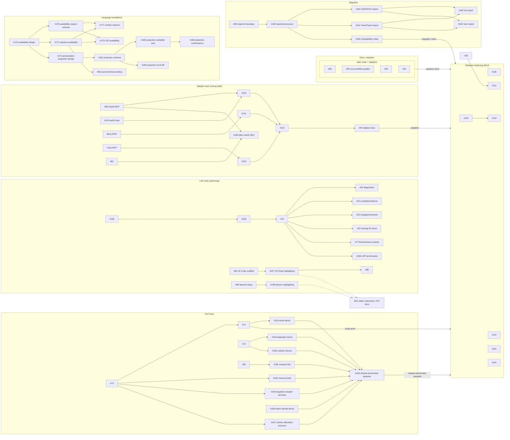

# Recite v1 Dependency Roadmap

A snapshot of how the open v1 milestones and issues depend on each other: what
can start now, what's blocked, and what's on the critical path.

This is a planning aid. The live Codeberg board and
`docs/recite-production-spec.md` §22–23 are authoritative; the issue numbers and
edges here were refreshed from the "Depends on" lines in issue bodies on 2026-06-03,
and will drift as work lands.

## v1 scope

Per spec §23, v1 is broader than "core + CLI + LSP." It requires all of:

- core runtime, CLI, and LSP authoring support;
- a scale and performance proof;
- a stable engine-adapter contract;
- at least one production-quality engine adapter;
- adoption and migration documentation that lets a team evaluate Recite against
  established dialogue tooling.

The release-hardening milestone (M14) can't complete until scale, adapters, and
adoption docs have all landed.

## Work that can start now

These issues have no unmet dependencies.

| Issue | Role | Unlocks |
| --- | --- | --- |
| #30 LSP semantic diagnostics | LSP track | richer authoring feedback |
| #31 LSP completions and hover | LSP track | schema-aware authoring |
| #32 LSP navigation and rename | LSP track | cross-file refactoring |
| #33 LSP missing-ID code action | LSP track | on-save ID workflow |
| #77 LSP block/schema code actions | LSP track | editor repair actions |
| #106 LSP large-project benchmarks | scale proof | LSP release evidence |
| #171 Requires-based choice availability | language foundations | #177, #179, #90 |
| #104 Large/epic CLI stress checks | scale proof | release evidence |
| #105 Memory profiles and known limits | scale proof | release known-limits docs |
| #126 `recite bench` command | scale proof | user-facing benchmark reports |
| #156 Compact ID storage switch | performance follow-up | reduced ID allocation pressure |
| #165 Realistic benchmark fixtures | scale proof | realistic project-shape evidence |
| #166 Targeted compiler phase benchmarks | scale proof | algorithmic hot-spot visibility |
| #167 Runtime allocation/clone pressure | scale proof | allocation-sensitive runtime evidence |
| #168 Watch rebuild latency stress | scale proof | authoring refresh evidence |
| #159 Import report/provenance model | migration | source-family importer prototypes |
| #81 Unity adapter design | design | feeds #108, Unity refresh |
| #84 VS Code LSP client scaffold | editor extensions | VS Code authoring workflow |
| #85 Neovim setup documentation | editor extensions | Neovim authoring workflow |
| #134 v0 wire sync risk | hardening | #113 |
| #136 Large Rust file cohesion audit | hardening | follow-up refactors as needed |
| #180 Generic condition/effect definitions | schema refactor | possible schema maintainability cleanup |

## Tracks

Each track below starts from one of the issues above. They all feed the release
milestone.



## Critical path

The adapter chain is still the longest release chain. The original adapter
contract design issue (#78), conformance-fixture issue (#79), and schema-domain
export issue (#140) are now closed. The current open chain is:

```
per-engine adapter MVPs + watch/editor refresh prerequisites → per-engine refresh workflows → adapter docs → release verification
```

The metadata-domain design gate (#137), metadata value syntax issue (#138),
metadata value-domain implementation (#139), and LSP project/schema index issue
(#76) are closed. The LSP track can now fan out into semantic diagnostics (#30),
completion/hover (#31), navigation/rename (#32), missing-ID code actions (#33),
block/schema repair actions (#77), and LSP scale benchmarks (#106).

The benchmark suite (#73), trace counters (#75), benchmark smoke/regression
policy (#74), and measured ID small-string evaluation (#36) are closed. The
performance track can now move into large/epic CLI stress checks (#104), memory
and known-limit reporting (#105), the user-facing `recite bench` command
(#126), the compact ID storage follow-up (#156), realistic benchmark fixtures
(#165), targeted compiler phase benchmarks (#166), runtime allocation/clone
pressure measurement (#167), and watch rebuild latency stress checks (#168).
Those measurement and coverage issues feed the blocked release benchmark
baseline profile (#169).

The docs site scaffold (#88), Rustdoc API examples (#91), migration transition
guides (#96), and importer-boundary design (#95) are closed. The broad
migration source-inspection issue (#97) has been split into import
report/provenance (#159), custom JSON/CSV import (#160), Twee/Twine import
(#161), ink import (#162), Yarn Spinner import (#163), and initial migration
compatibility notes (#164). VS Code LSP client scaffolding (#84) and Neovim
setup docs (#85) can now start. VS Code TextMate highlighting (#157) follows
#84, and Neovim Tree-sitter highlighting (#158) follows #85.

Choice availability has been split out of the source-format reference docs.
Issue #170 is closed and settled hidden-vs-disabled semantics, the final
availability syntax, and player-facing unavailable reason ownership. Issue #176
is also closed and now provides schema-owned availability reason definitions and
localisation extraction. Issue #171 is the current ready language-foundation
task; it implements the approved `requires=(...)` and `reason=...`
source/lowering model and, together with #176, unblocks #177 runtime reason
emission and #179 LSP availability diagnostics. Issue #172 is closed; it
settled the broader presentation projection contract that lets metadata on
lines, choices, blocks, and project inputs drive structured adapter-visible
affordances without committing RPG-specific syntax or runtime semantics to core
Recite.

The projection implementation follow-ups remain split by surface. #181 adds
schema-owned projection declarations and label-template extraction but remains
blocked until its live dependencies and labels are resolved. #182 compiles
projection declarations into self-contained wire data, #183 surfaces the schema
declarations through CLI/LSP diagnostics and authoring support, and #184 adds
adapter conformance coverage for projection-capable adapters.

The source-format page under #90 may still land stable sections such as blocks,
lines, speakers, metadata, choices without availability, targets, conditional
branches, effects, stable IDs, and related links. Final choice-availability
wording for that page remains blocked until #171 lands. The broader #90 core
workflow guides remain in the docs/adoption lane and keep their existing scale,
adapter-contract, #119, and adapter-detail blockers. Release-positioning docs
such as #89 remain blocked on scale evidence and credible adapter paths.

## Release hardening

The M14 "Release:" issues (#112–#116) sit at the end of the graph. They can't
start until scale, adapters, and adoption docs are in place.

Issues #134 and #136 are pre-release hardening tasks that can start earlier
because they reduce compatibility and review-surface risk before the final
release checklist work. Issue #135 has already landed the project-facing gate
script that release issue #112 can build on.
