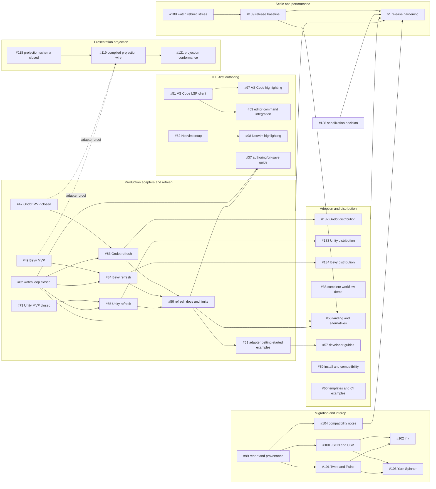

# Recite v1 Dependency Roadmap

This is the current dependency map for the work required by a serious Recite
v1. It was rebuilt from live GitHub issues on 2026-08-26 after the
Codeberg-to-GitHub migration.

The live [GitHub issue tracker](https://github.com/plethu/recite/issues) and
`docs/recite-production-spec.md` sections 22-23 are authoritative. This file is
a planning aid and must be refreshed when merged work closes, unblocks, or
supersedes an item.

## Numbering after the forge migration

Codeberg issue numbers are not GitHub issue numbers. GitHub also shares one
number sequence between issues and pull requests. Migration markers in issue
bodies (`migrated-from-codeberg-issue:<number>`) are the source of truth for
the old-to-new mapping; a matching bare number is not evidence of identity.

All numbers below are current GitHub issue numbers and link to the intended
issue. Historical Codeberg pull-request numbers have been omitted because they
do not identify GitHub pull requests.

## v1 scope

Per specification section 23, v1 requires all of:

- core runtime, CLI, and LSP authoring support;
- a scale and performance proof;
- a stable engine-adapter contract;
- production-quality Godot, Bevy, and Unity adapter paths;
- ecosystem-native distribution plans for those three adapters;
- adoption and migration documentation that lets a team evaluate Recite
  against established dialogue tooling.

The release-hardening milestone cannot complete until scale, adapters, and
adoption documentation have all landed.

## Work that can start now

These issues are open and have no confirmed unmet dependency. `status/ready`
is still a co-work signal, not permission to settle a subjective product or
durable API decision without review.

| Issue | Role | Unlocks or reduces risk |
| --- | --- | --- |
| [#108 Watch rebuild stress](https://github.com/plethu/recite/issues/108) | authoring-loop scale proof | release benchmark baseline and refresh evidence |
| [#51 VS Code LSP client](https://github.com/plethu/recite/issues/51) | IDE-first authoring | VS Code highlighting and command integration |
| [#52 Neovim setup](https://github.com/plethu/recite/issues/52) | IDE-first authoring | Neovim highlighting and command integration |
| [#99 Import report and provenance](https://github.com/plethu/recite/issues/99) | migration foundation | source-family importer prototypes and compatibility notes |
| [#91 Large-file cohesion audit](https://github.com/plethu/recite/issues/91) | maintainability | focused subsystem refactors where evidence warrants them |
| [#135 Typed serialization-boundary errors](https://github.com/plethu/recite/issues/135) | compatibility hardening | clearer snapshot and FFI error ownership |
| [#117 Generic condition/effect evaluation](https://github.com/plethu/recite/issues/117) | schema maintainability | a keep-or-refactor decision grounded in current duplication |
| [#140 Native Codex review acceptance](https://github.com/plethu/recite/issues/140) | review workflow | confirmation on the next genuine pull request |

Two `status/ready` issues need a residue or scope audit before implementation:

- [#89 v0 MessagePack wire sync risk](https://github.com/plethu/recite/issues/89)
  overlaps work already delivered by the shared tag surface and golden fixtures;
- [#136 unused LSP snapshot surface](https://github.com/plethu/recite/issues/136)
  describes accessors that now have test, benchmark, or feature consumers.

The following issues deliberately remain human-led design work:

- [#126 comparative benchmark corpus](https://github.com/plethu/recite/issues/126);
- [#138 serialization alternatives](https://github.com/plethu/recite/issues/138);
- [#123 visual-editor accessibility requirements](https://github.com/plethu/recite/issues/123).

## Dependency tracks

Closed foundations are shown where they explain an open edge. The graph avoids
inventing dependencies that are not supported by the specification, current
issue bodies, or delivered code.

## Critical path

### Authoring loop

The core LSP, missing-ID code action, `recite play`, and `recite watch` are
implemented. The remaining text-authoring work is to expose those capabilities
through real editor entry points and prove the refresh loop under load:

1. [#51 VS Code](https://github.com/plethu/recite/issues/51) and
   [#52 Neovim](https://github.com/plethu/recite/issues/52) expose the LSP;
2. [#53 editor command integration](https://github.com/plethu/recite/issues/53)
   follows the VS Code scaffold, while [#97](https://github.com/plethu/recite/issues/97)
   and [#98](https://github.com/plethu/recite/issues/98) own highlighting;
3. [#108 watch stress](https://github.com/plethu/recite/issues/108) proves the
   existing watch loop under generated-project edits;
4. [#37 authoring workflow documentation](https://github.com/plethu/recite/issues/37)
   waits on the delivered watch command plus the three engine refresh paths and
   their shared documentation in #86.

The public authoring-loop page is still a placeholder. IDE integration and
refresh evidence should precede claims that this workflow is production-ready.

### Engine adapters

Godot and Unity have runtime MVPs. Bevy remains the largest open v1 adapter gap:
[issue #49](https://github.com/plethu/recite/issues/49) must establish the Bevy
adapter before [#84](https://github.com/plethu/recite/issues/84) can provide its
asset-refresh path.

Godot [#83](https://github.com/plethu/recite/issues/83) and Unity
[#85](https://github.com/plethu/recite/issues/85) still carry `status/blocked`,
but their historical prerequisites map to delivered GitHub issues. Their issue
status and host-tooling choices should be refreshed before implementation.

All three refresh paths feed [#86](https://github.com/plethu/recite/issues/86),
which documents edit to LSP diagnostics to `recite watch` to adapter import or
refresh to scene restart or the explicit active-session policy. V1 does not
promise arbitrary mid-session patch reload.

### Scale and performance

Compiler/runtime benchmarks, realistic fixtures, profiling guidance, memory
reports, compact IDs, compiler phase probes, and runtime allocation evidence
are delivered. Open work is:

- [#108](https://github.com/plethu/recite/issues/108), measuring watch rebuild
  latency and stale-output behavior;
- [#109](https://github.com/plethu/recite/issues/109), the release baseline
  profile. All of its historical prerequisites except #108 map to delivered
  GitHub issues.

[#126](https://github.com/plethu/recite/issues/126) is a separate human-led
comparative-corpus decision. Its issue explicitly avoids making external
comparison availability a v1 blocker.

### Migration and adoption

The importer boundary and transition guides are delivered. The next foundation
is [#99](https://github.com/plethu/recite/issues/99), which defines structured
import reporting and provenance without committing Recite to source-specific
semantics. It feeds the v1 compatibility guidance in
[#104](https://github.com/plethu/recite/issues/104) and separately unlocks
optional source-specific prototypes in [#100](https://github.com/plethu/recite/issues/100),
[#101](https://github.com/plethu/recite/issues/101),
[#102](https://github.com/plethu/recite/issues/102), and
[#103](https://github.com/plethu/recite/issues/103). Serious-v1 acceptance
requires honest transition and compatibility guidance; it does not require
every source-family prototype to ship.

Adoption documentation must remain evidence-backed. Landing-page alternatives,
workflow guides, templates, distribution, and compatibility claims should
follow the adapter, scale, and migration surfaces they describe.

## Maintainability and compatibility hardening

- [#91](https://github.com/plethu/recite/issues/91) owns the large-Rust-file
  cohesion audit. Line count is a triage signal; cohesive wire, snapshot, and
  conformance surfaces should not be split merely to reduce a number.
- [#135](https://github.com/plethu/recite/issues/135) owns typed errors at the
  snapshot and FFI serialization boundaries.
- [#89](https://github.com/plethu/recite/issues/89) must first audit what remains
  after the delivered shared wire-tag and golden-fixture work.
- [#138](https://github.com/plethu/recite/issues/138) is the explicit human-led
  decision boundary for any pre-1.0 serialization-format change. It must close
  with a format and migration-policy decision before the v1 compatibility
  boundary hardens.

## Release hardening

The final milestone is represented by current GitHub issues:

- [#77 release candidate checklist](https://github.com/plethu/recite/issues/77);
- [#78 compatibility audit](https://github.com/plethu/recite/issues/78);
- [#79 packaging and installation smoke tests](https://github.com/plethu/recite/issues/79);
- [#80 final documentation/examples verification](https://github.com/plethu/recite/issues/80);
- [#81 known-limits and support policy](https://github.com/plethu/recite/issues/81).

They sit at the end of the graph. Pre-release hardening such as #91 and #135 can
land earlier, but the release checklist cannot honestly close until the
authoring loop, scale proof, adapter paths, distribution, migration, and
adoption documentation agree on the shipped product.
