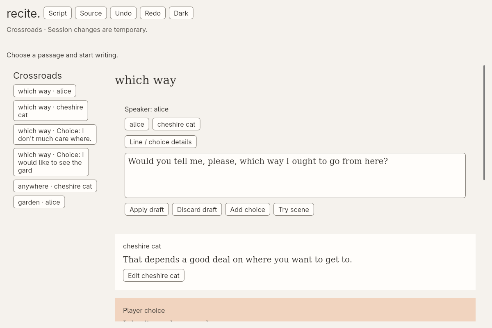
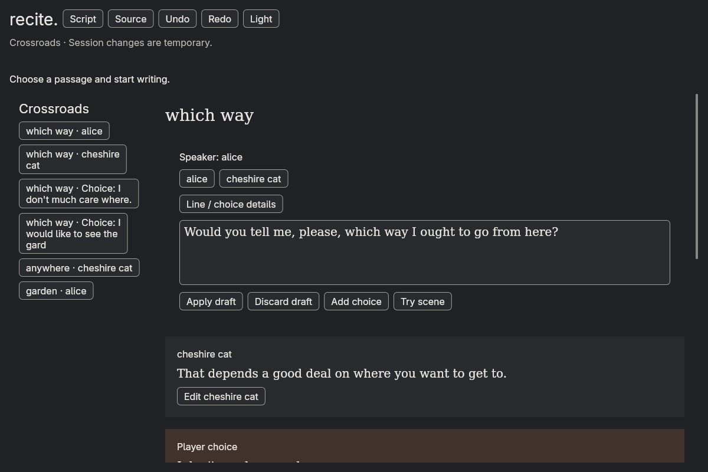
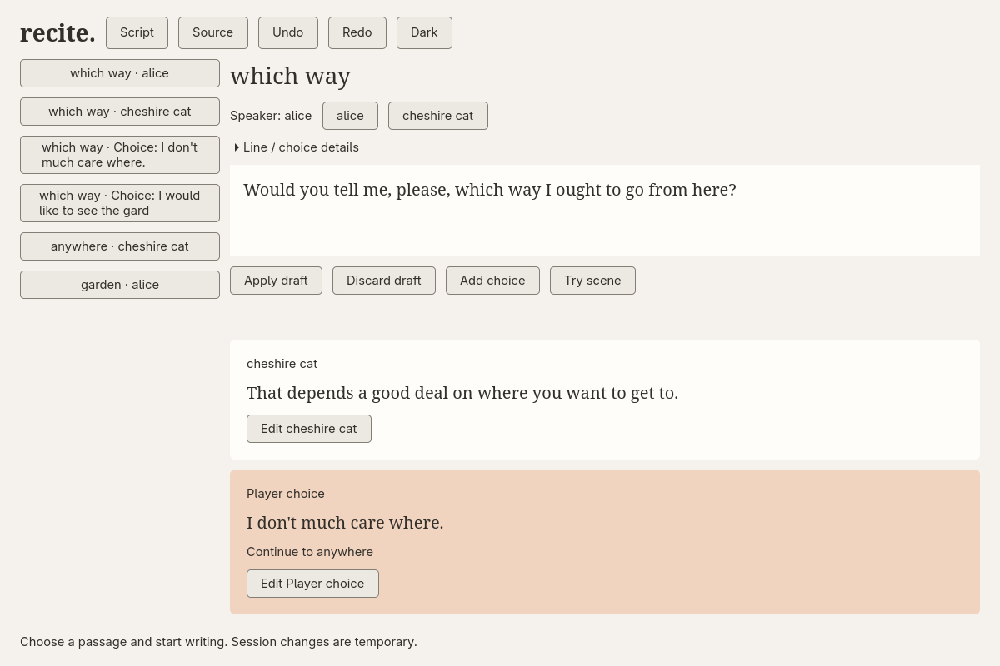
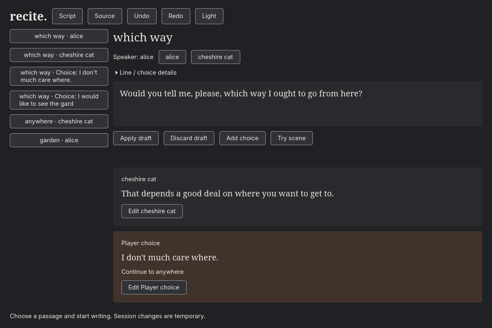
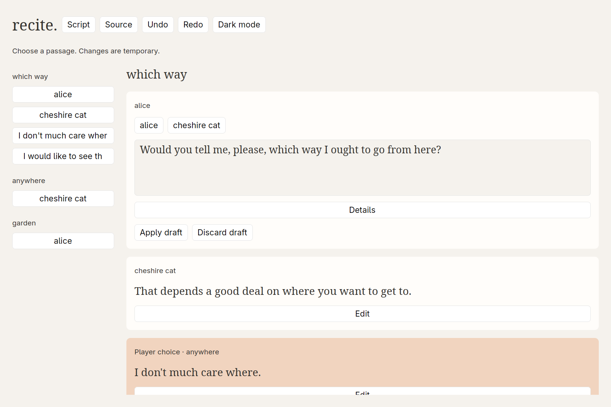
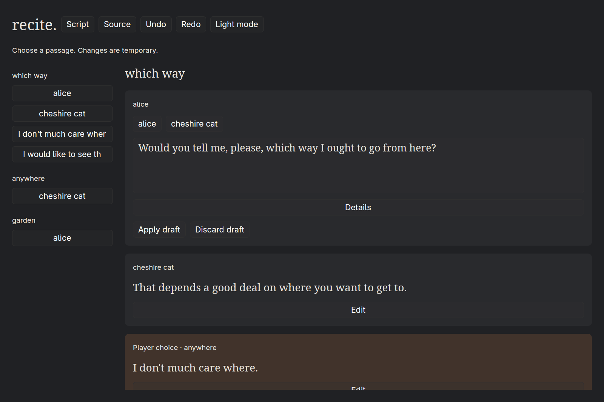

# Whole-scene writing comparison

Linux windows at 1200 × 800 logical size, captured 2026-09-07. These are the running
prototypes: the scene scrolls with one passage edited in place. The accepted
[visual language](../../docs/gui-visual-language.md) remains the design target;
these captures do not imply that every layout or accessibility gate has passed.

## Freya





Source: [light](captures/freya/source-light.png) · [dark](captures/freya/source-dark.png).

## GTK





Source: [light](captures/gtk/source-light.png) · [dark](captures/gtk/source-dark.png).

## GPUI





Source: [light](captures/gpui/source-light.png) · [dark](captures/gpui/source-dark.png).

GPUI now has the same bounded writer controls, including runtime preview.
The neutral surfaces, serif prose and peach choices fit the visual language.
The full-width Edit/Details buttons make this version feel busier and consume
reading space; they remain a layout refinement, not a toolkit verdict.

These PNGs retain the compositor's fractional-scale pixels: 1600 × 1067 for
the verified 1200 × 800 logical window. View them at the same displayed width
as the other entries. [Capture evidence](captures/gpui/evidence.json) records
both sizes. GPUI's Linux backend in this pinned release does not implement
`render_to_image`; the script uses `grim -T` with the unique window's foreign
toplevel identifier. It captures only that window, without workspace switching
or injected input.

```sh
cargo build --locked --manifest-path prototypes/gui-bakeoff/candidates/gpui/Cargo.toml
python3 prototypes/gui-bakeoff/scripts/capture-gpui.py
```

## Regenerate

Run from the repository root on Hyprland 0.56+:

```sh
python3 prototypes/gui-bakeoff/scripts/capture.py
```

Freya renders offscreen at 1200 × 800. GTK opens at the same logical size as a
floating window on a unique, silent workspace. A per-run application ID limits
the temporary rule to that window. The script does not switch workspaces or
send desktop keyboard/mouse events. GTK checks the actual window allocation
while its per-window background-rendering rule lets GTK finish normal layout; a wrong size or empty snapshot
fails the capture. The script validates all eight PNG dimensions before
replacing the saved images.

Capture processes run in an owned process group, terminated on failure or
interruption. The temporary rule is disabled afterwards; Hyprland 0.56 retains
the disabled entry until its next normal configuration reload. The script does
not reload or edit desktop configuration. The rule uses Hyprland's
[window-rule API](https://wiki.hypr.land/configuring/core/rules/window-rules/).

GTK still uses native child-widget rendering on the application's background,
not a desktop screenshot. Neither entry includes window decorations. The
native layout reflects its real floating allocation; the earlier forced
child allocation has been removed. Physical keyboard, IME and accessibility
checks remain separate from these scripted captures.

See the [evidence ledger](evidence.md) for tested behaviour and remaining checks.
